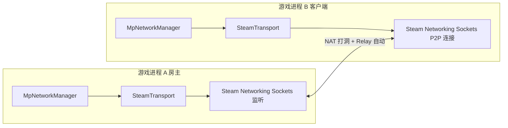

# Steam 多人联机集成方案

> 项目：JNOmultiplayerTest（SimpleRockets 2 / JNO 联机 mod aMptest）
> 创建日期：2026-08-13
> 状态：✅ 已落地（SteamTransport 已实现并设为默认传输；spike 已验证 Steamworks.NET 可直调）

---

## 〇、经验教训（归档修订）

> 本文方案已按 3.1~3.3 落地，归档为开发经验记录。**两处保留/不做的说明**：`LiteNetLibTransport` 备用未启用；Lobby 邀请（3.4 进阶）**【决策:不做】**，维持"手动输入房主 SteamId"（`SteamJoinLobby <hostSteamId>`）。

**结论**：`SteamSpike`（[`SteamSpike.cs`](../Assets/Scripts/Net/SteamSpike.cs)）验证 mod 运行时能直接调 `SteamUser.GetSteamID()` / `SteamNetworkingSockets`；`SteamTransport`（[`SteamTransport.cs:21`](../Assets/Scripts/Net/SteamTransport.cs:21)）实现 `IMpTransport`：房主 `CreateListenSocketP2P` + 客户端 `ConnectP2P` + 每帧 `RunCallbacks()`；`MpNetworkManager.Transport` 默认即 `SteamTransport`（[`MpNetworkManager.cs:35`](../Assets/Scripts/Net/MpNetworkManager.cs:35)），`SteamJoinLobby <hostSteamId>` 加入。

**经验教训**：

1. **先 spike 再铺路**：一行直调脚本先验证 Steamworks.NET 运行时可用，再写传输类，避免方向性返工。
2. **游戏已 `SteamAPI.Init()`，mod 不重复 Init**：直接复用（[`SteamTransport.cs:19`](../Assets/Scripts/Net/SteamTransport.cs:19) 注释），用 `SteamAPI.IsSteamRunning()` 判断即可。
3. **FishNet 高层 API 被 codegen 否决是放弃框架的根因**（mod DLL 运行时加载无序列化器）→ 传输层自建，房间 / 状态 / XML 逻辑全部自持。
4. **Steamworks.NET 复用游戏自带 DLL**（`SimpleRockets2_Data/Managed/com.rlabrecque.steamworks.net.dll`），无需自带 / 打包。
5. **`MpPeer.EndPoint`（IPEndPoint）在 Steam 下不适用** → 新增 `MpPeer.SteamId`（`ulong`），传输层内部维护 `SteamId ↔ MpPeer` 映射。

**✅ 实测完成（2026-08，用户确认）**：双 Steam 账号公网联机可行——零 frp、零端口转发；日志链（`OnPlayerJoin` → `OnCraftXmlResponse` → 飞船互见）、断线/重连、大 XML 传输均确认通过。

---

## 一、目标

把联机传输层从「自建 TCP / LiteNetLib UDP + frp 内网穿透」升级为 **Steam P2P（Steam Networking Sockets）**，实现：
- **零端口转发 / 零 frp**：Steam NAT 打洞 + Relay 中继自动处理内网穿透（效仿 SP2 的 `FishySteamworks` 方案）；
- 保留已落地的 **SP2 craft XML 按需下载** 消息层设计（PlayerJoin 只带 hash，客户端按需拉取）；
- 传输层接口与现有 [`TcpTransport`](../Assets/Scripts/Net/TcpTransport.cs) / [`LiteNetLibTransport`](../Assets/Scripts/Net/LiteNetLibTransport.cs) 完全兼容，`MpNetworkManager.Transport` 字段无缝切换。

---

## 二、背景与现状

### 2.1 为什么换 Steam
| 阶段 | 结论 |
|---|---|
| FishNet 高层 API | ❌ 被 codegen 否决（mod DLL 运行时加载无序列化器） |
| LiteNetLib UDP | ✅ 本机回环通，但公网 frp 不支持 UDP → 无法穿透 |
| TcpTransport TCP | ✅ 可走 frp TCP 隧道，但仍是"需要内网穿透配置"的方案 |
| **Steam P2P** | ✅ 玩家零配置穿透，最友好；SP2 官方就是这么做的 |

### 2.2 已确认的可行性关键点（调研 `C:\renko\shitProgram\jnoCode` + 游戏安装目录）
1. **JNO 是 Steam 游戏**（App ID **870200** = SimpleRockets 2），Steamworks 已由游戏初始化；
2. **游戏 Managed 目录已带 Steamworks.NET**：`com.rlabrecque.steamworks.net.dll`（`SimpleRockets2_Data/Managed/`）—— mod 可通过 `AssemblyResolve` 直接引用，**无需自带 DLL**；
3. **游戏内部 Steam 入口**：`SocialExt`（`Assets.Packages.SocialPlatforms` 命名空间，在 `Packages.dll`），提供 `IsSteam` / `Active` / `Steam` 等；游戏自己的 [`ModManagerScript`](../C:/renko/shitProgram/jnoCode/SimpleRockets2/Assets/Scripts/Mods/ModManagerScript.cs) 已证明 mod 代码路径可调 Steam API（Workshop）；
4. **mod 侧两条访问路**：
   - A（推荐）：asmdef 引用 `"com.rlabrecque.steamworks.net"`（Steamworks.NET），直接 `SteamAPI` / `SteamUser` / `SteamNetworkingSockets`；
   - B（备选）：asmdef 引用 `"Packages"`，走 `SocialExt`。

---

## 三、方案设计

### 3.1 总体架构

- `MpNetworkManager` 房间逻辑 / 状态同步 / craft 按需下载 **完全不变**（传输无关）；
- 仅替换 [`MpNetworkManager.Transport`](../Assets/Scripts/Net/MpNetworkManager.cs) 字段类型。

### 3.2 SteamTransport 接口（与现传输层兼容）

| 成员 | 说明 |
|---|---|
| `Start(int port)` | 房主：创建 ListenSocket（Steam 里 port 无意义，仅占位） |
| `StartClient(string host, int port, byte[] hello)` | 客户端：`host` 改为**房主 SteamId（64位）或 LobbyId**，连接后发 Hello |
| `Stop()` / `Dispose()` | 关闭连接/监听 |
| `DrainIncoming()` | 每帧 `SteamNetworkingSockets.RunCallbacks()` + 收包分发 |
| `SendTo(MpPeer, byte[])` | 按 peer 的 SteamId 发消息（可靠通道） |
| `Broadcast(byte[])` | 发给所有已连接 peer |
| `GetPeers()` / `GetPeersCount()` | 对端列表 |
| `OnDataReceived(MpPeer, byte[])` / `OnPeerTimeout(MpPeer)` | 事件 |
| `LocalPort` / `IsRunning` | 属性 |

> 注：`MpPeer.EndPoint`（IPEndPoint）字段在 Steam 下不适用，改用 `MpPeer.SteamId`（新增 `ulong` 字段）寻址；`MpPeer` 加字段，传输层内部映射 `SteamId ↔ MpPeer`。

### 3.3 通道语义（对齐 SP2 8.1）
- Steam Networking Sockets 消息可靠/不可靠可选：
  - 状态包 → `k_nSteamNetworkingSend_Unreliable`（低延迟）；
  - 大 XML（CraftXmlResponse）→ 可靠通道。
- Steam 消息上限较大（默认 ~1MB 分片自动处理），通常无需应用层分片；需 spike 实测确认。

### 3.4 房间 / 邀请（对应 SP2 的 SteamLobbyManager）
- **房主**：`SteamMatchmaking.CreateLobby()` → 得到 `LobbyId`，UI 显示邀请链接 / 好友邀请；
- **客户端**：加入 Lobby（`SteamMatchmaking.JoinLobby()`）→ 从 Lobby 元数据或成员列表拿房主 `SteamId` → `SteamTransport.StartClient(房主SteamId)`；
- 简化 MVP：也可不做 Lobby，直接"房主 SteamId 手动输入"（`SteamId` 可查），先验证 P2P 通道，再加 Lobby。

---

## 四、实施步骤

### Step 1：可行性 spike（✅ 完成）
- [x] 在 [`aMptest.asmdef`](../Assets/aMptest.asmdef) references 加 `"com.rlabrecque.steamworks.net"`（编译通过，走直调路线）；
- [x] 写临时脚本（[`SteamSpike.cs`](../Assets/Scripts/Net/SteamSpike.cs)）：`SteamUser.GetSteamID()` / `SteamFriends.GetPersonaName()` / `SteamNetworkingSockets` 初始化，验证 mod 运行时能拿到 Steam 身份；
- [x] 结论：能拿 SteamId + SteamNetworkingSockets 可初始化 → 继续直调路线。

### Step 2：实现 SteamTransport（✅ 完成）
- [x] 新增 `Assets/Scripts/Net/SteamTransport.cs`（接口同 TcpTransport，含 `MpPeer.SteamId` 映射）；
- [x] 实现房主 ListenSocket（`CreateListenSocketP2P`）+ 客户端 `ConnectP2P` + 每帧 `RunCallbacks()`；
- [x] 可靠/不可靠通道按消息类型选择（复用 [`MpMessage`](../Assets/Scripts/Net/MpMessage.cs) 首字节判断）。

### Step 3：房间接入（✅ MVP 完成；Lobby【决策:不做】）
- [x] MVP：`SteamJoinLobby <hostSteamId>` 手动输入房主 SteamId；房主 `SteamHostLobby` 显示本机 SteamId；
- [~] （**【决策 2026-08】不做**）`SteamMatchmaking` Lobby 创建/加入/邀请 —— 维持手动 SteamId 方案。

### Step 4：验证（✅ 全部完成）
- [x] 回 Unity 编译无报错；
- [x] **双 Steam 账号**（两台机器或同机双开两个账号）公网联机：零 frp、零端口转发 —— **✅ 已实测可行（2026-08 用户确认）**；
- [x] 确认日志链：`OnPlayerJoin: requested craft xml` → `OnCraftXmlResponse: received craft xml` → 飞船互见（公网实测确认）；
- [x] 断线/重连、大 XML 传输（公网实测确认）。

---

## 五、风险与回退

| 风险 | 应对 |
|---|---|
| Steamworks.NET asmdef 引用编译不过 | 方案 B（引 `"Packages"` 走 SocialExt）或反射；或自带 Steamworks.NET DLL 打包进 mod |
| SteamAPI.Init() 在游戏已初始化后调用冲突 | 不重复 Init；直接复用（游戏已初始化）。若必须，用 `SteamAPI.IsSteamRunning()` 判断 |
| Steam P2P 需要 App ID 匹配 | JNO 是 870200，双方必须都是正版通过 Steam 启动该游戏；测试需用两个正版账号 |
| Steam 无网/离线 | 保留 TcpTransport/LiteNetLib 作为 fallback（字段可切） |
| 大 XML 超 Steam 单消息限制 | 复用 LiteNetLib 的应用层分片逻辑，或确认 Steam 自动分片行为 |

---

## 六、与现有工作的关系

- **已落地且保留**：SP2 craft XML 按需下载（[`MpMessage.cs`](../Assets/Scripts/Net/MpMessage.cs) 的 hash + CraftXmlRequest/Response、[`MpNetworkManager.cs`](../Assets/Scripts/Net/MpNetworkManager.cs) 的按需拉取/缓存）—— 与传输层无关，直接复用；
- **已落地且备用**：`TcpTransport`（当前字段）、`LiteNetLibTransport`；
- **不动的**：远程飞船生成/插值/销毁、朝向同步、body/多 craft —— 全部传输无关。

---

## 七、决策记录

- 2026-08-13：FishNet 高层 API 被 codegen 否决；frp 不支持 UDP → 决定引入 Steam API 实现零端口转发穿透，效仿 SP2 的 FishySteamworks；
- 2026-08-13：确认 JNO（AppID 870200）已集成 Steam，游戏 Managed 自带 `com.rlabrecque.steamworks.net.dll`，mod 可复用；游戏 `ModManagerScript` 证明 mod 代码路径可调 Steam API；
- 2026-08-15：SteamTransport 按本文落地并设为默认传输（[`MpNetworkManager.cs:35`](../Assets/Scripts/Net/MpNetworkManager.cs:35)）；`SteamJoinLobby <hostSteamId>` 手动输入房主 SteamId（Lobby 未做）；TCP 保留为 VM debug 通道（见 [`tcp-transport-for-vm-debug.md`](tcp-transport-for-vm-debug.md)）。
