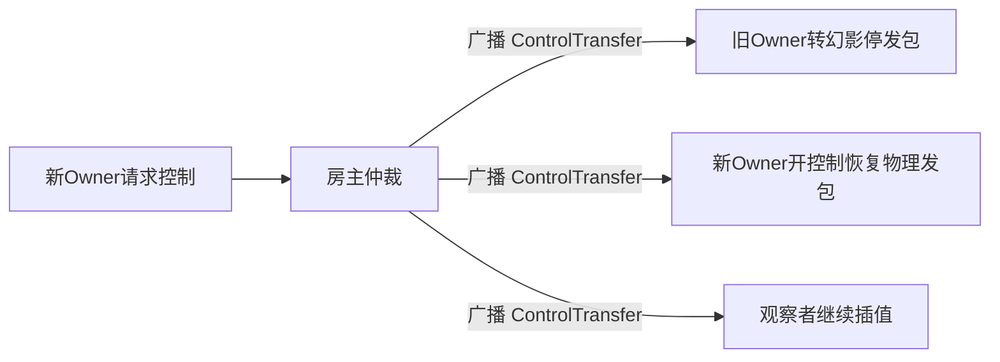

# SR2 联机模组（JNOmultiplayerTest）现状与下一步计划

> 项目：JNOmultiplayerTest（SR2 模组 aMptest）
> 参照源码：`C:\renko\shitProgram\jnoCode`（SimpleRockets2 反编译 + ModApi）
> 更新日期：2026-08-13

## 一、结论摘要

**联机可行且已跑通主干**。当前实现已完成"主机-客户端 + 快照同步"的最小闭环：两玩家各自控制飞船、互相看到对方飞船实时运动、朝向（srfRel 相对地表）双端一致。剩余工作集中在**同步质量与玩法深度**：

1. **平滑插帧 + 延迟补偿**：当前是前后两包线性/Slerp 插值，需升级为带时间戳环形缓冲 + 渲染延迟补偿，容忍抖动与乱序；
2. **Body 同步**：当前仅同步每 body 相对根欧拉角，需补 body 位置/速度/角速度与分离/对接/残骸事件；
3. **多 craft**：当前仅同步每玩家唯一活动飞船，需支持一玩家多飞船（按 `(playerId, nodeId)` 寻址）与活动飞船切换；
4. **控制权交接**：多飞船/对接场景下"谁控制哪艘飞船"的权威转移（单权威原则）；
5. **物理距离外同步**：当前幻影把远程飞船一律当"地面飞船"处理且始终满载，需按距离分层（轨道传播 / 地图图标），复用游戏原生 LOD。

> 物理交互（远程飞船碰撞/对接）仍是最大风险，MVP 采用"幻影"策略（物理禁用、只跟随插值）。

---

## 二、架构现状（已实现）

### 2.1 传输层：Steam P2P（默认）+ TCP/UDP 可替换
传输层抽象统一（`Start/Host`、`Join`、`SendTo/Broadcast`、`OnDataReceived/OnPeerTimeout`），三种实现可切换：
- [`SteamTransport`](Assets/Scripts/Net/SteamTransport.cs)（**默认**）：Steam Networking Sockets P2P，零端口转发/零 frp，SP2 同款；
- [`TcpTransport`](Assets/Scripts/Net/TcpTransport.cs)：纯 TCP，可走 frp/nginx，MTU 无限制；
- [`LiteNetLibTransport`](Assets/Scripts/Net/LiteNetLibTransport.cs)：UDP + 可靠/不可靠通道分离 + 分片。

切换点：[`MpNetworkManager.Transport`](Assets/Scripts/Net/MpNetworkManager.cs:34)。早期已弃用原始 UDP。

### 2.2 会话与寻址（已完成）
- 房主中继模式：客户端状态包 → 房主 → 转发其他客户端（[`OnState`](Assets/Scripts/Net/MpNetworkManager.cs:721)）。
- 握手/房间流程：`Hello`（加入）→ `Welcome`（分配 PlayerId）→ `PlayerJoin`（广播玩家 + 飞船 hash）→ 按需 `CraftXmlRequest/Response` 拉取飞船 XML（SP2 方案，见 [`MpMessage.cs`](Assets/Scripts/Net/MpMessage.cs:10)）。
- 状态包 20Hz：`(PlayerId, NodeId, FlightState.Time, recdata)`（[`EncodeState`](Assets/Scripts/Net/MpMessage.cs:218)）。

### 2.3 远程飞船：生成 + 幻影 + 朝向（已完成）
- [`SpawnRemoteCraftAtPosition`](Assets/Scripts/Net/MpNetworkManager.cs:823)：`LoadCraftImmediate` + `SpawnCraft`，用首个状态包的真实位置生成。
- 幻影模式（[`InitializeRemoteCraft`](Assets/Scripts/Net/MpNetworkManager.cs:1074)）：`AllowPlayerControl=false` + `SetPhysicsEnabled(false, Warp)` + `DisableCraftPhysicCalculation` + 刚体 kinematic，远程飞船不参与物理。
- 朝向：srfRel 相对地表朝向（LunaMultiplayer 方案），warp 无漂移、Pitch/Bank 双端一致（详见 [`plans/mp-heading-sync.md`](plans/mp-heading-sync.md)）。
- 状态应用统一入口：[`ApplyRemoteState`](Assets/Scripts/Net/MpNetworkManager.cs:1261)（GroundedSurface* + SetStateVectors + 视觉朝向 + RecalculateFrameState + FlightData 刷新）。

### 2.4 稳定性（已完成）
- 管理器 `DontDestroyOnLoad` 跨场景存活（[`Mod.EnsureMpManager`](Assets/Scripts/Mod.cs:160)）；
- TCP 发送超时防挂死、协程延迟生成防白屏、掉线/超时用 `DestroyCraft()` 真正销毁（[`RemoveRemoteCraft`](Assets/Scripts/Net/MpNetworkManager.cs:903)）；
- 状态包/心跳用 `unscaledDeltaTime`，游戏暂停也不停发。

---

## 三、源码关键能力（联机基础，背景）

- 飞行场景原生多飞船：`FlightState.CraftNodes` + `AddCraft/CraftNodeAdded`（多 craft 联机的基础）。
- 运行时生成"别的玩家"的飞船：`LoadCraftImmediate(XElement)` + `SpawnCraft(name, craftData, location, xml)`。
- 玩家控制权：`CraftNode.AllowPlayerControl`（本机 true / 远程 false）。
- 时间系统：`TimeManager` 统一驱动所有节点；联机限制 1x 实时 + 房主广播暂停。

---

## 四、下一步详细计划（按优先级）

### P1 · 平滑插帧（带时间戳环形缓冲）
现状：`UpdateRemoteCrafts` 只保留 `Prev/Target` 两包，按本地 `Time.unscaledTime` 在发送间隔内线性/Slerp 插值（[`MpNetworkManager.cs:1154`](Assets/Scripts/Net/MpNetworkManager.cs:1154)）。问题：网络抖动/乱序会导致跳变或"快进/倒退"。

计划：
1. `RemoteCraft` 增加环形缓冲 `StateSample[]`（容量约 16，对应 ~800ms @ 20Hz），元素 = `(FlightState.Time, recdata)`；
2. 新包按时间戳插入（二分定位），丢弃早于插值窗口的旧包，容忍乱序；
3. 渲染时取 `renderTime = now - renderDelay` 前后的两包做插值，插值逻辑复用现有内联 lerp/Slerp（位置/速度线性、朝向球面、body 姿态沿用最新包）；
4. `renderDelay` 目标 100~150ms（2~3 包 @ 20Hz），缓冲不足时自动回退为直接应用最新包；
5. 缓冲欠载（连续丢包）：先用最新包 `Velocity` 做短暂外推（≤1 个发送间隔），超时仍无包则冻结并标记"掉线/暂停"；
6. 状态应用路径（`ApplyRemoteGroundedSurface` + `SetStateVectorsAtDefaultTime` + `RecalculateFrameState`）保持不变，只在插值阶段替换数据来源。

**验收**：固定速率运动下接收端平滑无跳变；人为丢包 30% 无倒退/橡皮筋。

### P2 · 延迟补偿（RTT + 时钟偏移）
现状：`Ping/Pong` 已有，但 `Pong` 不回带 tick，无法计算 RTT（[`MpMessages.EncodePong`](Assets/Scripts/Net/MpMessage.cs:393)）。

计划：
1. `Pong` 回带 Ping 的 tick；`MpNetworkManager` 维护每玩家 RTT 滑动平均；
2. 状态包携带发送端墙钟（`DateTime.UtcNow.Ticks`），结合 RTT 计算两端时钟偏移（滑动平均去噪）；
3. 渲染延迟 `renderDelay = clamp(RTT/2 + jitterBuffer, 50ms, 250ms)`，默认 100~150ms；
4. 与 P1 缓冲共用时间轴：渲染时间用"接收端墙钟 + 时钟偏移"对齐到发送端时间线；
5. 本机玩家不做本地预测（自权威、无服务器回滚，MVP 不需要）。

**验收**：Ping 显示稳定；相同网络条件下接收端飞船无回弹。

### P3 · Body 同步（位置/速度/角速度 + 事件）
现状：只同步 `BodyRotations`（每 body 相对根欧拉角，[`recdata`](Assets/Scripts/Mod.cs:233)）。问题：body 局部位置偏移、角速度、分离/对接/残骸不同步 → 远程飞船"分裂/散架"后无法复现。

计划：
1. `recdata`（或独立 BodyState 包）扩展每 body：`localPosition`（相对根/质心）、`localRotation`（已有）、`localAngularVelocity`、`localVelocity`，序列化同步加字段（[`WriteRecdata`](Assets/Scripts/Net/MpMessage.cs:400)）；
2. **分离/残骸事件**：发送端 body 分离（残骸分裂、`DestroyBody`）时广播 `BodyDetachEvent(bodyId, worldState)`；接收端在幽灵飞船上对应 body 做视觉分离（保留 kinematic 跟随状态或按事件移除）；
3. **对接事件**：两飞船对接合并 → `DockingEvent`（合并后的 craft XML / node 信息），接收端重新 `SpawnCraft` 合并后的飞船并销毁旧 ghost；
4. **爆炸/销毁事件**：`BodyDestroyedEvent` 隐藏/移除对应 body；
5. body 身份：优先用稳定标识（部件路径/生成顺序 ID）；MVP 可用 body 索引 + 数量，数量不匹配时触发按 XML hash 重载重建；
6. 状态包新增 `BodyCount` 校验字段，发送端 body 增删时附带事件而非仅靠状态包。

**验收**：远程飞船分离/残骸与发送端一致；对接后双端合并为同一飞船。

### P4 · 多 craft 支持（每玩家多飞船 + 切换）
现状：`_remoteCrafts` 按 `playerId` 一对一（[`MpNetworkManager.cs:51`](Assets/Scripts/Net/MpNetworkManager.cs:51)）；本机只采样 `FlightSceneScript.Instance.CraftNode`（活动飞船，[`GetLocalCraftNodeId`](Assets/Scripts/Net/MpNetworkManager.cs:1403)）。

计划：
1. 远程映射改为复合键 `(playerId, nodeId)`：`_remoteCrafts[(playerId,nodeId)]`，玩家离开时移除其名下所有节点；
2. 本机采样遍历 `FlightState.CraftNodes` 中本玩家的**所有**节点（含活动飞船、残骸/对接后的多节点），每个节点各自 20Hz 发包；
3. **活动飞船切换**：状态包带 `IsActive` 标志；玩家切换活动飞船时广播 `ActiveCraftChange(playerId, nodeId)`，接收端同步相机焦点/控制指示；
4. 加入时上报本玩家**全部**飞船 XML（每艘一个 hash，按需下载，复用现有 SP2 机制）；
5. 场景重载后按 `(playerId,nodeId)` 全量重建。

**验收**：一名玩家 2 艘飞船，对端两台都正确显示且互不覆盖；切换活动飞船对端焦点跟随。

### P5 · 控制权交接（Control Handover）
背景：远程飞船 `AllowPlayerControl=false`（幻影）。多飞船/对接后需要明确"谁控制哪艘飞船"，避免双端同时模拟冲突。

计划（MVP）：
1. **单权威原则**：每艘飞船同一时刻只有 1 个权威拥有者（Owner），其余端都是观察者（幻影）；
2. **交接消息** `ControlTransfer(craftKey, fromPlayerId, toPlayerId)`：
   - 新 Owner：`AllowPlayerControl = true` + 恢复物理（`SetPhysicsEnabled(true)` + 取消 kinematic + 重开碰撞/阻力），开始对该飞船发包；
   - 旧 Owner：`AllowPlayerControl = false` + 转幻影，停止发包（避免双写）；
   - 观察者：无变化（继续按新 Owner 的状态包插值）；
3. 触发场景（MVP 先做）：**活动飞船切换**（P4 本机内切换不跨端）；进阶再做**对接共乘**——A 的飞船与 B 对接/相连，B 可请求控制；
4. 冲突仲裁：以房主为仲裁（`ControlTransfer` 经房主校验后广播），防止两玩家同时抢控；
5. **主机迁移**（房主掉线重选）：MVP 不做，房主掉线即会话结束（所有客户端停止）。

**验收**：A→B 交接后 B 能正常驾驶该飞船、A 端看到的是 B 的状态包插值，无双写抖动。

### P6 · 时间/暂停同步
现状：[`OnPause`](Assets/Scripts/Net/MpNetworkManager.cs:735) 被临时禁用（暂停相关问题未定位）。

计划：
1. 重新启用 `Pause` 消息：房主按暂停 → 广播 `PauseMessage`，客户端 `TimeManager.RequestPauseChange`（恢复 P1~P3 期间的暂停问题回归验证）；
2. 强制 1x：连接时 `SetNormalSpeedMode()`，MP 期间禁用 warp（warp 会放大时钟偏移/插值误差）；
3. 时钟偏移校准并入 P2（状态包时间戳 + RTT 滑动平均）。

### P7 · 事件同步与打磨（后续）
- 事件可靠通道：对接/分离/爆炸/销毁等事件走可靠通道（状态包可不可靠）；
- UI：[`UI.cs`](Assets/Scripts/UI.cs) 增加延迟/丢包显示、玩家名/颜色标记远程飞船；
- 断线重连：客户端断线后保留玩家表，短时自动重连；
- 日志收敛：移除诊断性循环日志、降低 GC（已部分完成：渲染器数组缓存、收包缓冲复用）。

### P8 · 物理距离外的同步（LOD 分层 + 轨道传播）
**现状与问题**：当前远程飞船一律强制 `InContactWithPlanet=true` + 表面锁定 + 每帧 `GroundedSurface*` 应用（[`ApplyRemoteState`](Assets/Scripts/Net/MpNetworkManager.cs:1261)），物理用 `Warp` 禁用（[`InitializeRemoteCraft`](Assets/Scripts/Net/MpNetworkManager.cs:1074)）。导致：
1. **轨道中的远程飞船被当"地面飞船"**：`CraftNode.UpdateCraft` 走了 grounded 分支而非轨道分支，位置随本端行星自转漂移、无轨道运动；
2. **远端也满载**：完整 ghost（数千 renderer）始终加载，游戏原生 LOD 无法降级，带宽/CPU 浪费；
3. 玩家进入深空/换行星后，仍每帧强制地面校正，误差与成本都不可控。

**游戏原生机制（反编译确认）**：
- 距离管理：[`GameViewScript.LoadDynamicNodes`](../C:/renko/shitProgram/jnoCode/SimpleRockets2/Assets/Scripts/Flight/GameView/GameViewScript.cs:658)：
  - `_physicsLoadDistance = PhysicsDistance × 1000`，卸载 +100m 迟滞（[`UpdatePhysicsDistance`](../C:/renko/shitProgram/jnoCode/SimpleRockets2/Assets/Scripts/Flight/GameView/GameViewScript.cs:759)）；
  - 距 < 加载距离 → `SetPhysicsEnabled(true, LoadPhysics)`（warp 除外）；距 > 卸载距离 → `SetPhysicsEnabled(false, UnloadPhysics)`；
  - 距 > `max(GameViewLoadDistance², physicsLoad²) × 1.05` → 移出 GameView（`_craftScript = null`）。
- 离物理状态推进：[`CraftNode.UpdateCraft`](../C:/renko/shitProgram/jnoCode/SimpleRockets2/Assets/Scripts/Flight/Sim/CraftNode.cs:1189)：
  - `InContactWithPlanet` → `GroundedSurface*` 驱动（:1232）；否则 → `Orbit.AdvanceTime` 解析轨道传播 + `RecalculateFrameState`（:1238）；
  - `_craftScript == null`（移出 GameView）→ 仍 `Orbit.AdvanceTime` 轨道传播（:1202）。
- 轨道重建：[`OrbitNode.SetStateVectors`](../C:/renko/shitProgram/jnoCode/SimpleRockets2/Assets/Scripts/Flight/Sim/OrbitNode.cs:364) → `Orbit.UpdateFromStateVectors` 从 位置/速度/时间/天体质量 重建轨道；[`Orbit.AdvanceTime`](../C:/renko/shitProgram/jnoCode/SimpleRockets2/Assets/Scripts/Flight/Sim/Orbit.cs:564) 为确定性二体解析推进（与发送端相同时间线则结果一致）。
- MapItem 切换：[`MapCraft.IgnorePhysicsChange`](../C:/renko/shitProgram/jnoCode/SimpleRockets2/Assets/Scripts/Flight/MapView/Items/MapCraft.cs:564)：`Warp`/`FlightEnd` 被忽略（不切换），`UnloadPhysics` 等触发切 `MapStaticOrbitItem` —— 本项目曾遇 MapView NRE 的根源，故远程飞船禁物理一律用 `Warp` 原因。

**设计：远程飞船 = 正常 FlightState CraftNode + 全程禁物理 + 按距离分层校正**
1. `InContactWithPlanet` 跟随发送端：状态包新增标志；地面飞船走 `GroundedSurface*`，轨道飞船走 `Orbit.AdvanceTime` 传播；
2. 状态包新增 `ParentPlanetId`/`SoiId`；SOI 变化（变更环绕天体）广播 `ChangedSoi` 事件 → 接收端 `TransitionToNewSoi`，否则会绕错天体；
3. 分层（按接收端到远程飞船距离，复用游戏阈值）：
   - **Tier0 物理距离内**：完整 ghost + P1 插值逐帧应用（现状）；
   - **Tier1 物理外 / GameView 内**：节点保留、物理 off（`Warp`）；轨道 → 降频校正（1~4Hz 重设状态向量，其余帧由 `Orbit.AdvanceTime` 传播）；地面 → `GroundedSurface*` 降频更新；MapCraft 低 LOD 显示；
   - **Tier2 移出 GameView**：纯轨道传播 + 地图图标（游戏原生 MapCraft/节点），仅 SOI 变化或偏差超阈值时校正（0.5~1Hz）；
4. 带宽：MVP 发送端仍 20Hz 采样，接收端按 Tier 决定应用/校正频率（P1 缓冲照常累积不丢包）；后续可由房主按观察者距离对中继节流；
5. 边界迟滞：进出 Tier0 复用 P1 缓冲状态避免跳变（参照游戏 100m 迟滞）；
6. 风险规避：禁物理一律 `Warp` 原因（避免 `UnloadPhysics` 触发 MapItem 切换 NRE）；P6 锁 1x 保证 `Orbit.AdvanceTime` 与发送端同步推进（warp 会放大偏差）。

**验收**：两玩家相距 > 物理距离时，远端轨道飞船平滑运动、不随本端行星自转漂移；移出 GameView 后只剩地图图标、无渲染开销；进入物理距离时无缝恢复完整 ghost。

---

## 五、实施里程碑（更新）

### M1 · 网络原型 ✅
- [x] Steam P2P（默认）/ TCP / LiteNetLib 三传输抽象 + 房间流程 + 心跳保活

### M2 · 飞船加载与显示 ✅
- [x] craft XML 按需交换（SP2 hash + 分片 + 重发/Ack）+ `LoadCraftImmediate` + `SpawnCraft` 生成远程飞船
- [x] 幻影模式（禁止控制 + 禁物理 + kinematic）+ 映射管理 + 掉线销毁

### M3 · 状态同步与插值（进行中）
- [x] 朝向 srfRel 同步（双端实测通过，[`plans/mp-heading-sync.md`](plans/mp-heading-sync.md)）
- [ ] **P1 平滑插帧**：带时间戳环形缓冲 + 渲染延迟
- [ ] **P2 延迟补偿**：RTT + 时钟偏移校准

### M4 · Body、多 craft 与距离分层（未开始）
- [ ] **P3 Body 同步**：位置/速度/角速度 + 分离/对接/残骸事件
- [ ] **P4 多 craft**：`(playerId,nodeId)` 映射 + 活动飞船切换
- [ ] **P8 物理距离外同步**：LOD 分层 + 轨道传播 + SOI 事件

### M5 · 控制权与时间（未开始）
- [ ] **P5 控制权交接**（单权威 + ControlTransfer）
- [ ] **P6 时间/暂停同步**（1x + 暂停广播 + 时钟偏移）
- [ ] **P7 事件同步 + 打磨**（延迟/丢包 UI、玩家标记、断线重连）

---

## 六、关键难点与风险

| 风险 | 等级 | 应对 |
|---|---|---|
| 远程飞船物理交互（碰撞/对接） | 高 | MVP 幻影（禁物理）；进阶把碰撞判定交给拥有方广播结果 |
| 物理距离外的远程飞船 | 中 | P8：LOD 分层 + 轨道传播；轨道飞船不再强制地面分支，移出 GameView 用地图图标 |
| 时间/暂停/延迟不一致 | 中 | 锁定 1x + 房主广播暂停 + 插值缓冲 + RTT 时钟校准（P2/P6） |
| 多人视觉一致 | 中 | 快照同步天然 100~200ms 视觉延迟，可接受；极致一致超 MVP |
| 飞船设计/行星系统一致 | 低 | 同行星系统才能 SpawnCraft；MVP 房主指定行星系统 |
| 反编译内部 API 依赖 | 低 | 固定游戏版本，游戏更新需回归 |

---

## 七、开放问题（需确认）

1. 传输层已从早期 UDP 切换到 Steam P2P（[`SteamTransport`](Assets/Scripts/Net/SteamTransport.cs) 默认），FishNet 是否仍需引入？（建议：不再引入，Steam 穿透零配置最省心）
2. 双方测试需同一行星系统（M2 生成飞船前提），如何约定？（建议：房主指定行星系统，加入端校验）
3. P5 控制权交接的场景优先级：先做"活动飞船切换"还是"对接共乘"？（建议先活动飞船切换，成本低收益高）
