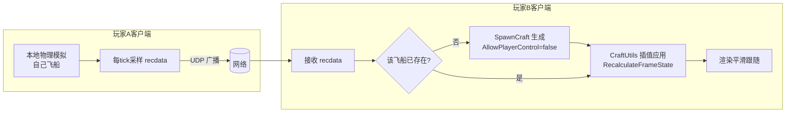

# Replay 模组 → 联机模组 可行性分析报告

> 项目：JNOmultiplayerTest（SR2 模组 aMptest）
> 参照源码：`C:\renko\shitProgram\jnoCode`（SimpleRockets2 反编译 + ModApi）
> 日期：2026-08-04

## 一、结论摘要

**结论：可行，且可行性较高。** 游戏源码天然支持"一个飞行场景内运行多艘飞船节点"，并且当前 Replay 系统本质上已经是"状态采样 → 传输 → 插值应用"的雏形，这两点恰好是联机同步的核心。改造的核心工作不是"从零搭建多人框架"，而是：

1. 把 Replay 的"本地录制/回放数据源"替换为"网络接收的数据源"；
2. 实现一个轻量网络传输层（游戏本体无任何多人网络能力）；
3. 通过官方公开 API（`SpawnCraft` / `AddCraft` / `LoadCraftImmediate`）实现"把其他玩家的飞船加载进本机场景"。

**主要风险**集中在：远程飞船的物理交互（碰撞/对接）、时间/暂停同步、以及游戏物理的非确定性（无法做锁步模拟，只能做快照同步）。

---

## 二、游戏源码关键发现（联机基础能力）

### 2.1 游戏没有任何多人联机基础设施 ✅（需自建网络层）
- 全源码搜索网络相关代码，仅存在：
  - HTTP 分享/上传：`WebClient` / `WebsiteRequest` / `ClientResponse`（分享飞船、存档、Bug 上报）。
  - `StartupScript.InitializeSingleInstanceServer`（单实例进程互斥检测）。
- **不存在**任何 Socket/TCP/UDP 多人框架、房间、同步逻辑。网络层需完全自建。

### 2.2 飞行场景原生支持多艘飞船 ✅（最关键基础）
- [`FlightState.CraftNodes`](C:/renko/shitProgram/jnoCode/SimpleRockets2/Assets/Scripts/State/FlightState.cs:120) 是 `List<CraftNode>`，公开只读，游戏本身就管理多艘飞船（残骸、对接、多节点）。
- 有 `CraftNodeAdded` / `CraftNodeRemoved` 事件（[`FlightState.cs`](C:/renko/shitProgram/jnoCode/SimpleRockets2/Assets/Scripts/State/FlightState.cs:111)），可监听玩家加入/离开。
- **运行时动态添加飞船节点**：公开方法 [`FlightState.AddCraft(CraftNode, CraftNode originalNode)`](C:/renko/shitProgram/jnoCode/SimpleRockets2/Assets/Scripts/State/FlightState.cs:320)，自动分配 `NodeId`、注册到 MapView、触发 `CraftNodeAdded`。

### 2.3 可在飞行场景中生成"别的玩家"的飞船 ✅
- 公开方法 [`FlightSceneScript.SpawnCraft(string name, CraftData craftData, LaunchLocation location, XElement pendingXml)`](C:/renko/shitProgram/jnoCode/SimpleRockets2/Assets/Scripts/Flight/FlightSceneScript.cs:735)：输入飞船设计数据 + 发射位置，在飞行场景实例化一艘新飞船并加入 FlightState。
- 公开接口 [`ICraftLoader.LoadCraftImmediate(XElement craftXml)`](C:/renko/shitProgram/jnoCode/ModApi/Craft/ICraftLoader.cs:13)：从 **craft XML 字符串**直接加载 `CraftData`。
- 组合使用：**收到其他玩家的 craft XML → LoadCraftImmediate → SpawnCraft**，即可在他机器上复现对方飞船。
- 参考运行时创建 CraftNode 的完整范例：[`CraftSplitter.SplitCraftNode`](C:/renko/shitProgram/jnoCode/SimpleRockets2/Assets/Scripts/Flight/Sim/CraftSplitter.cs:105)（残骸分裂）展示如何创建 CraftNode、挂接物理 CraftScript、加入 FlightState。

### 2.4 玩家控制权可精细控制 ✅
- `CraftNode.AllowPlayerControl`：模组在 [`Record()`](Assets/Scripts/Mod.cs:403) 中已使用（`node.AllowPlayerControl = false`）。
- 联机策略：**本机玩家飞船 `AllowPlayerControl = true`；远程飞船 `false`**，避免本地玩家误操控他人飞船。

### 2.5 时间系统统一驱动所有节点 ✅（需同步）
- [`TimeManager`](C:/renko/shitProgram/jnoCode/SimpleRockets2/Assets/Scripts/Flight/TimeManager.cs:21) 多档时间：暂停(0) / 慢动作 / 实时(1x) / 快进 / 时间加速(warp)。
- 所有 `CraftNode.UpdateCraft(elapsedTime, currentTime)` 由统一时间驱动，`FlightState.Time` 是全局飞行时间（`IGameTime`）。
- 联机策略：**限制 1x 实时（NormalSpeedMode），暂停需主机广播**；warp 会让同步复杂度剧增，MVP 阶段禁用。

---

## 三、当前 Replay 系统的可复用性（核心资产）

当前模组已经实现了一个"伪网络"的完整闭环，联机只是把**数据源**从"本地 List"换成"网络接收"：

| Replay 组件 | 职责 | 联机复用方式 |
|---|---|---|
| [`recdata`](Assets/Scripts/Mod.cs:239) | 位置/速度/朝向/控制输入/激活组/分级 | **直接作为网络包载荷**，仅需加时间戳与 NodeId |
| [`RecordSystem.Record()`](Assets/Scripts/Mod.cs:388) | 采样飞船状态 | 改为"本机飞船状态 → 发送到网络" |
| [`ReplaySystem.Replay()`](Assets/Scripts/Mod.cs:541) | 插值应用远端状态 | 改为"收到网络数据 → 插值应用"，**几乎不变** |
| [`CraftUtils.InterpolatedTransform`](Assets/Scripts/CraftUtils.cs:246) | 位置/速度/朝向插值 | **直接复用**（联机状态平滑的核心） |
| [`CraftUtils.RecalculateFrameState`](Assets/Scripts/CraftUtils.cs:31) | 参考系换算/刚体刷新 | **直接复用** |
| [`CraftUpdatePatch`](Assets/Scripts/Mod.cs:651) | Harmony Postfix 驱动 Record/Replay | 扩展为驱动"本地发送 + 远程接收应用" |

**关键洞察**：Replay 的 `frame` 索引 → 联机改为网络包的时间戳缓冲队列；`RecordData[frame]` → 网络接收的环形缓冲。插值（lerp）逻辑、`SetCraftTransform`、`RecalculateFrameState` 全部原样复用。

---

## 四、推荐架构：主机-客户端 + 快照同步

游戏物理是 Unity PhysX，**非确定性**，无法做锁步（lockstep）确定性模拟。因此唯一现实方案是**快照同步（Snapshot / State Sync）**：



### 4.1 角色模型
- **MVP：P2P / 主机-客户端混合**，每个客户端**权威控制自己的飞船**（Self-Authoritative），把状态广播给他人。
- 房主额外负责：房间管理、时间/暂停广播、飞船加入/离开协调。
- 不做服务器权威（避免单点与复杂回滚）。

### 4.2 状态包设计（基于 recdata 扩展）
```
MPStatePacket
├─ NodeId        （对应目标飞船，用于 SpawnCraft/寻址）
├─ TimeStamp     （FlightState.Time，用于时间对齐与插值）
├─ recdata       （位置/速度/朝向/控制输入/激活组/分级）
└─ (可选) 部件位姿 / 燃料量 / 载荷状态
```

### 4.3 飞船加入流程
1. 新玩家连接房主，发送自己飞船的 **craft XML**（`CraftNode.LoadCraftData()` 或 craft 文件）。
2. 房主广播"玩家加入 + 该玩家飞船 XML"给所有客户端（含新玩家本人，以便生成他人飞船）。
3. 各客户端用 `LoadCraftImmediate(XElement)` + `SpawnCraft(...)` 生成该玩家飞船，标记 `AllowPlayerControl = false`，并注册到 `NodeId → CraftNode` 映射。
4. 玩家离开 → 移除/隐藏对应飞船节点（可用 `CraftNode.DestroyCraft()` 或隐藏）。

### 4.4 状态接收与插值
- 每客户端维护"每 NodeId 一个 recdata 环形缓冲"，带时间戳。
- 每帧（在 `CraftUpdatePatch.Postfix` 中）为远程飞船按时间戳取前后两包做 `CraftUtils.InterpolatedTransform` + `RecalculateFrameState`。
- 缓冲目标：**渲染延迟约 100~150ms**（buffer 2~3 包），补偿抖动与乱序。
- 超时（如 1s 无包）→ 飞船标记为"暂停/掉线"状态。

### 4.5 时间/暂停同步
- 强制所有客户端 `TimeManager.SetNormalSpeedMode()`（1x 实时）。
- 房主按下暂停 → 广播 `PauseMessage`，各端 `RequestPauseChange`。
- 通过状态包内 `FlightState.Time` 做时钟偏移校准（每个包都带时间戳，滑动平均计算 RTT/偏移）。

---

## 五、网络层选型

游戏本体无网络能力，需自建。推荐（按适配度排序）：

| 方案 | 优点 | 缺点 | 建议 |
|---|---|---|---|
| **FishNet**（默认 LiteNetLib transport） | 开源 MIT、维护活跃；开箱即用的连接管理/RPC/对象生成/序列化/时间同步与 NetworkTransform，底层即 LiteNetLib | 框架较完整，需注意**不接管 SR2 场景**、避免直接挂载游戏飞船对象 | **首选**：省去大量脚手架，同时保留对同步逻辑的完全控制 |
| **LiteNetLib**（UDP） | 轻量、Unity 友好、自带可靠通道/连接/序列化、延迟补偿工具 | 需自行实现 RPC/对象生成/时间同步等上层逻辑 | 次选：若仅需最小依赖 |
| 原始 UDP `System.Net.Sockets` | 零依赖（[`DataProcess.cs`](Assets/Scripts/DataProcess.cs) 已预留 using） | 需手写可靠传输/连接/序列化，工作量最大 | 若完全不想引外部依赖则选此 |
| Mirror / UNET / Photon | 功能全 | 面向"游戏引擎级"多人，体积大、与单机 SR2 场景模型冲突 | 不推荐（与游戏自身的单机场景/存档机制难以集成） |

#### FishNet 集成要点（本项目的正确用法）

1. **只当"传输 + RPC 库"用，不接管场景**：关闭 FishNet 的 SceneManager（场景托管），SR2 的 `FlightScene` / 存档 / 加载流程仍由游戏自身控制，FishNet 只负责连接、通道与消息收发。
2. **不用 NetworkTransform 直接驱动游戏飞船**：飞船状态仍由模组自写逻辑（复用 `CraftUtils`）应用，避免 `NetworkBehaviour` 侵入 `CraftNode` / `CraftScript` 对象。可在独立的 Mod GameObject 上挂 `NetworkBehaviour`，用 **RPC + 属性同步**收发 `recdata`。
3. **权威模型匹配**：FishNet 原生支持 **Owner 权威**（OwnerAuthority），与本方案"每玩家权威自己飞船"的 Self-Authoritative 架构天然吻合——`recdata` 状态包以飞船拥有者（Owner）为准，广播给其他观察者。
4. **双精度位置**：飞船位置/速度为 `Vector3d`（double PCL 坐标）。若用 NetworkTransform 需开启双精度模式；更推荐自写 `BinaryWriter` 写 double，与 `recdata` 完全对应且更省带宽。
5. **时间戳对齐**：FishNet 提供 tick / 时间同步（`TimeManager` / Tick），可辅助 4.5 的时钟偏移校准；状态包仍以自带 `FlightState.Time` 作为最终对齐依据。

**序列化**：推荐 `BinaryWriter` 手写紧凑二进制，或 JsonUtility/LiteNetLib 内置序列化。recdata 字段少且固定，手写二进制最省带宽。

---

## 六、关键难点与风险

### 6.1 高 · 远程飞船的物理交互（碰撞/对接/残骸）
- 远程飞船若参与物理，会产生"两个客户端物理结果不一致→来回弹跳"的抖动。
- **MVP 策略**：远程飞船渲染为"幻影"——用 `CraftUtils.DisableCraftPhysicCalculation`（模组已实现）关闭碰撞/气动/热损，只跟随状态插值。
- 进阶：碰撞检测交给"拥有方"判定后广播结果（如爆炸/分离事件）；对接（docking）作为独立事件消息处理。

### 6.2 中 · 时间/暂停与网络延迟
- 暂停/时间倍率不一致会导致严重不同步。MVP 锁定 1x 实时 + 主机广播暂停。
- 延迟补偿：利用状态包时间戳 + 插值缓冲（见 4.4），并可通过本地预测（对远程飞船不做本地预测，减少复杂度）。

### 6.3 中 · 多人同时观看同一艘飞船的视觉一致
- 快照同步天然有 100~200ms 视觉延迟，属可接受范围；若追求极致一致需权威服务器 + 延迟补偿 + 回放纠错，超出 MVP。

### 6.4 低 · 飞船设计/存档一致性
- 联机各方必须**同一行星系统**（`FlightStateData.PlanetarySystem`）才能 `SpawnCraft`。MVP 要求房主指定同一行星系统，或广播行星系统文件。

### 6.5 低 · 模组对反编译内部代码的依赖
- 模组依赖 `Assets.Scripts.Flight / Craft / State` 内部命名空间（通过 `jnoCode` 源码引用编译），**游戏更新可能破坏 API**。需固定游戏版本。

---

## 七、实施里程碑（建议拆分）

### M1 · 网络原型（最小闭环） ✅ 2026-08-05 实测通过（自建 UDP，未采用 FishNet）
- [x] 引入网络传输（采用自建 UDP Socket 封装 [`UdpTransport`](Assets/Scripts/Net/UdpTransport.cs)）
- [x] 局域网 IP 直连 + 房间（房主/加入者）基础流程（HostLobby/JoinLobby/StopLobby）
- [x] 状态包序列化（基于 recdata + NodeId + 时间戳）（[`MpMessages.EncodeState`](Assets/Scripts/Net/MpMessage.cs:159)）
- [x] 本机飞船状态定时发送（20Hz，[`ProcessOutgoing`](Assets/Scripts/Net/MpNetworkManager.cs:167)）
- [ ] 保活/心跳（M1 遗留问题，纳入下一步优先解决）

### M2 · 飞船加载与显示（下一步）
- [ ] 玩家加入时交换**完整** craft XML（当前 [`RefreshLocalCraft`](Assets/Scripts/Net/MpNetworkManager.cs:129) 传空 XML，需修复）
- [ ] 连接保活，避免未进飞行场景被 3 秒超时踢出
- [ ] `LoadCraftImmediate` + `SpawnCraft` 生成远程飞船
- [ ] `NodeId → CraftNode` 映射管理
- [ ] 远程飞船 `AllowPlayerControl = false` + 禁用物理（复用 [`CraftUtils.DisableCraftPhysicCalculation`](Assets/Scripts/CraftUtils.cs:165)）

### M3 · 状态同步与插值
- [ ] 复用 `CraftUtils.InterpolatedTransform` / `RecalculateFrameState` 应用远程状态
- [ ] 带时间戳的环形缓冲 + 延迟补偿（100~150ms）
- [ ] 掉线/超时处理（飞船冻结/移除）
- [ ] 玩家离开时移除远程飞船

### M4 · 时间与事件同步
- [ ] 强制 1x 实时 + 暂停广播
- [ ] 时钟偏移校准（基于包时间戳 RTT）
- [ ] 基础事件消息（对接/分离/爆炸）广播

### M5 · 联机 UI 与打磨
- [ ] 联机按钮/房间列表 UI（在 [`UI.cs`](Assets/Scripts/UI.cs) 中扩展）
- [ ] 延迟/丢包显示
- [ ] 稳定性与异常处理

---

## 八、结论

- **核心可行性高**：游戏原生多飞船场景 + `SpawnCraft/AddCraft/LoadCraftImmediate` 公开 API + 现有 Replay 状态插值逻辑，构成了联机所需 90% 的基础。
- **主要工作**：网络传输层（推荐 FishNet，见第五节）与"数据源切换"（Replay → 网络），以及远程飞船物理交互的取舍。
- **建议路径**：按 M1→M5 递增交付，MVP（M1~M3）即可实现"两玩家各自控制飞船、互相看到对方飞船实时运动"的可玩原型。

---

## 九、当前进展与下一步（2026-08-05）

### 9.1 M1 已验证（网络原型闭环 ✅）

VMware NAT + 宿主机 Windows 实测通过：
- 房主 `HostLobby`（UDP 25555）绑定成功；虚拟机 `JoinLobbyPort 192.168.249.1 25555` 加入成功。
- 握手链路完整：客户端 Hello → 房主 `OnHello` 分配 PlayerId=1 → 回 Welcome。
- 实测经验：**VM 默认网关（192.168.249.2）是 VMware NAT 服务 vmnat 的地址，并非宿主机网卡 IP**；要连宿主机上运行的进程，应使用宿主机 VMnet8 真实 IP（192.168.249.1）。

### 9.2 实测暴露的问题（下一步需优先解决）

1. **3 秒超时踢人（阻塞性）**：握手成功后房主日志 `MP peer timeout: 192.168.249.128:51539 (PlayerId=1, NodeId=-1)`。
   - 根因：当前无心跳包（Ping/Pong 只定义编码、从不自动发送）；状态包仅在飞行场景有飞船时发送；客户端未进飞行场景时 `GetLocalCraftNodeId()` 返回 -1，既不发 CraftData 也不发状态包 → 房主按 3000ms 超时将其移除（[`CheckTimeouts`](Assets/Scripts/Net/UdpTransport.cs:187)）。
   - 修复方向：① 增加心跳/空状态包保活；② 未进飞行场景阶段放宽超时；③ 连接期间周期性发送最小包。
2. **CraftData 携带空 XML**：[`RefreshLocalCraft`](Assets/Scripts/Net/MpNetworkManager.cs:129) 发送 `EncodeCraftData(LocalNodeId, string.Empty)`，`GetLocalCraftNodeId` 只取 NodeId 不取飞船 XML → 房主广播的 PlayerJoin 中 craftXml 为空，远程端无法据此生成飞船（M2 前提缺失）。

### 9.3 下一步执行清单（M2 + M1 收尾）

1. **连接保活**：在 `MpNetworkManager`/`UdpTransport` 增加心跳或空状态包；未进飞行场景时也周期性发包，解决 3 秒被踢。
2. **完整 CraftData**：客户端上报本机飞船 craft XML（研究 `ICraftData`/`CraftNode` 序列化为 XML 的公开 API），替换 `string.Empty`。
3. **房主映射与广播**：`OnCraftData` 登记 PlayerId→NodeId→craftXml，广播带 XML 的 PlayerJoin。
4. **远程飞船生成**：各客户端 `OnPlayerJoined` 中用 `ICraftLoader.LoadCraftImmediate(XElement)` + `SpawnCraft(...)` 生成远程飞船，注册 NodeId→CraftNode 映射。
5. **幻影模式**：远程飞船 `AllowPlayerControl=false` + 复用 [`CraftUtils.DisableCraftPhysicCalculation`](Assets/Scripts/CraftUtils.cs:165)。
6. **状态应用**：`OnRemoteState` 接收 recdata，复用 [`CraftUtils.InterpolatedTransform`](Assets/Scripts/CraftUtils.cs:246) / `RecalculateFrameState` 应用到远程 CraftNode。
7. **VMware 双端联机验证**：双方各自开飞船进入同一行星系统，互相可见、运动平滑、无超时踢人。

**开放问题（需确认）**：
- 网络层继续沿用现有自建 UDP 栈（M1 已打通，推荐，避免返工），暂不引入 FishNet？
- 双方测试需处于同一行星系统（M2 生成飞船的前提），如何约定（房主指定行星系统）？
